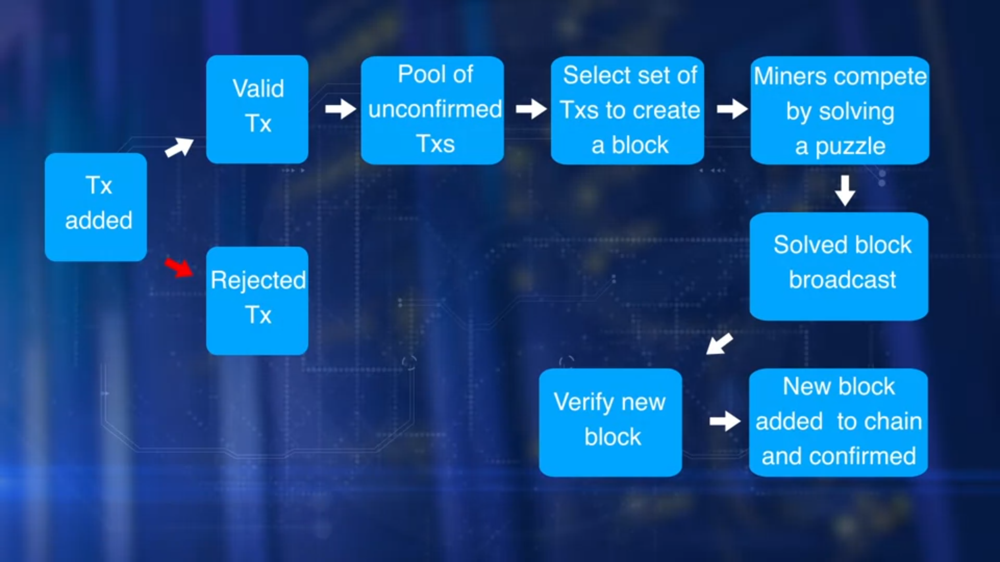

# Basic Operations

Operations in the decentralized network are the responsibility of the peer participants and their respective computational nodes.

- Laptop
- Desktop
- Server racks

## Operations include

- Validation transactions
- Gathering the transactions for a block
- Broadcasting the ballot transactions in the block
- Consensus on the next block creation
- Chaining the blocks to form an immutable record

## Role of miners

Participants that initiate transfer of value by creating a transaction, additional participants called miners, who pick on added work or computation. They miners are incentivised with bitcoins for the efforts in managing the blockchain.

- To verify transactions
- Broadcast transaction
- Compete to claim the right to create a block
- Work on reaching consensus by validating the block
- Broadcasting the newly created block
- Confirming transactions.

### Transaction validation criteria

Transaction validation is carried out independently by all miners which involves validation of more than 20 criteria, including size, syntax, etc.

- Referenced Input Unspent Transaction Output
- UTXOs are valid
- Reference output UTXOs are correct
- Reference input amount and output amount matched sufficiently
- Invalid transactions are rejected and will not be broadcast

## Addition of a new block

### Challenge

1. All the valid transactions are added to a pool of transactions.
2. Miners select a set of transaction from this pool to create a block.
3. This creates a challenge.
4. If every miner adds the block to the chain, there will be many branches to the chain, resulting in inconsistent state.
5. The blockchain is a single consistent linked chain of flux.

### Solution

1. Miners compete to solve a puzzle to determine who earn the right to create the next block.
2. In case of bitcoin blockchain, this is computational and CPU intensive.
3. Once a miner solves the puzzle, the announcement and the block are broadcast to the network.
4. Then, other participant verify the new block.
5. Participants reach a consensus to add a new block to the chain.
6. This new block is added to their local copy of the blockchain.
7. Thus, a new set of transactions are recorded and confirmed.

## Algorithm

- The algorithm for consensus is called proof-of -work protocol
- It involves computational power to solve the puzzle and to claim the right to form the next block.
- Transaction zero, index zero of the confirmed block is created by the miner of the block.
- It has a special UTXO and does not have any input UTXO.
- It is called the coinbase transaction that generates a minor's fees for the block creation.
- Currently, the minor's fees is 12.5 BTC for a bitcoin.
- This is how a new coin is mined in bitcoin blockchain.

## Summary

The main operations in a blockchain are transaction validation and block creation with the consensus of the participants. There are many underlying implicit operations as well in the bitcoin blockchain.

## Resources

- [How a Bitcoin Transaction Works](https://www.ccn.com/bitcoin-transaction-really-works/)
- [How does the Blockchain Work? (Part 1)](https://medium.com/blockchain-review/how-does-the-blockchain-work-for-dummies-explained-simply-9f94d386e093)
- [How Does the Blockchain Work?](https://medium.com/@micheledaliessi/how-does-the-blockchain-work-98c8cd01d2ae)
- [How Do Bitcoin Nodes Verify Transactions?](https://smartereum.com/8970/how-do-bitcoin-nodes-verify-transactions/)
