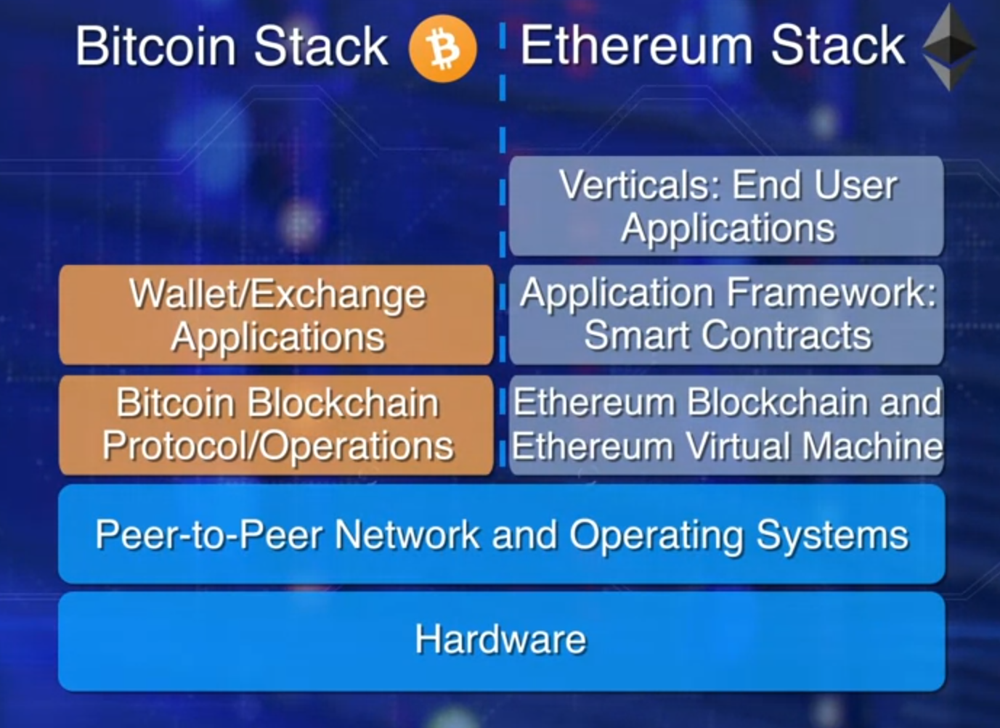

# Smart Contracts

- Bitcoin blockchain is the mother of all blockchains.
- It was intended for peer to peer transfer of value and it does that well.
- Around 2013, a framework for code execution was introduced by Ethereum Founders.
- The centerpiece and thrust of this Ethereum blockchain is a smart contract.

## Bitcoin vs Ethereum Blockchain

- Consider the above diagram comparing Bitcoin and Ethereum blockchain.
- On the left is the Bitcoin blockchain and a wallet application for initiating transactions.
- On the right is Ethereum that took a significant step towards transforming the blockchain into a computational framework.
- It opened up a whole world of opportunities in the decentralized realm.
- Ethereum supports smart contracts and of virtual machine on which smart contracts execute.
- Smart contracts in turn enable decentralized application that accomplish more than a transfer of value.
- Efficient automation of decentralized application such as supply chain.

## What is a Smart Contract?

- A smart contract is a piece of code deployed in the blockchain node.
- Execution of a smart contract is initiated by a message embedded in the transaction.
- Digital currency transfer request simple addition and subtraction.
- Ethereum enables transaction that may carry out more sophisticated operations.

For example, a transaction could require a conditional transfer, it may require some evaluation, it may need more than one signature for transfer of assets, or it may involve waiting for a specific time or date.

### What a Smart Contract can do?

Let's consider an example of an auction bidding  logic.
If the age of a bidder is greater than 18 and the bid is greater than the minimum bid, then, accept the bid, or else reject the bid.
This can be done by a smart contract.

What does the smart contract look like?
How do you write a smart contract?

Structurally, a smart contract resembles a class definition in an object oriented design.
It has data, functions or methods with modifiers public or private, along with getter and set of functions.
Specific programming languages have been designed for coding smart contracts.
Solidity is one such language. Let's examine a simple Solidity smart contract to understand its structure.

First line with pragma indicates the version of the solidity language.
The contract's name is in the first line.
This particular contract is for one integer storage.
The data for the integer is defined with type a name, uint StoredData.
Two functions are defined for writing and reading the data, set and get.Code execution.

Where does the code in the smart contract get executed?
Where is it located in a node?

We need a computational infrastructure to execute any arbitrary code.
Every node in Ethereum network should be able to execute the code irrespective of that underlying type of hardware or operating system.

Ethereum Virtual Machine, EVM.
An EVM provides a run anywhere obstruction layer for the contract code.
A smart contract written in a high level programming language is translated into EVM byte code, and then, deployed on the Ethereum Virtual Machine, EVM.
Every node will host the same smart contract codes on the EVM.

Summarry

Smart contracts add a layer of logic and computation to the trust infrastructure supported by the blockchain.
Smart contracts allow for execution of code.
Enhancing the basic value transfer capability of the Bitcoin blockchain.
The code for this smart contract is written in a high level language like Solidity and compiled into byte code.
The code for the smart contracts is executed on a special structure known as Ethereum Virtual Machine.

Ethereum has worked out marvelously on how to solve these problems of scaling and privacy and a number of other issues that needed to be worked out for public networks. You have the Enterprise Ethereum Alliance that is the largest organization of entities working on the Ethereum protocol and maturing it into something that industry can use. But at the same time, companies around the Hyperledger project, Fabric and Iroha and Sawtooth and all these other protocol initiatives under the Linux Foundation and what they call the Hyperledger project. That has led to a whole bunch of other breakthroughs around channels and contracts segregation. So you remember I was saying, you and I have an agreement and we need to all be in control but not anyone having the control system. All right, well that's fine. But if you and I have a confidential agreement and nearly all business to business agreements are confidential. It says right on the contract it says, ''not only is this contract confidential between you and me, the existence of it is confidential.'' Most of the pharmaceutical industry operates on this. The medical industry operate on this principle for good and bad. You could say, ''Well we'd like some more transparency there.'' But we also don't want your medical records out in the clear, and we don't want the fact that you're even paying for a particular drug to be out in the clear. Right? Or that you're using a particular drug. That's not Okay. So, we need transparency for some things and opacity for other things and getting that mix right is really hard. So, we need things like channels and charting and now in Ethereum plasma and what we call Layer two technologies that are coming out this year and next that really will transform our concept of block chain.

## Resources

- [What is Ethereum?](http://ethdocs.org/en/latest/introduction/what-is-ethereum.html)
- [Smart Contracts: The Blockchain Technology That Will Replace Lawyers](https://blockgeeks.com/guides/smart-contracts/)
- [Introduction to Smart Contracts](http://solidity.readthedocs.io/en/develop/introduction-to-smart-contracts.html)
